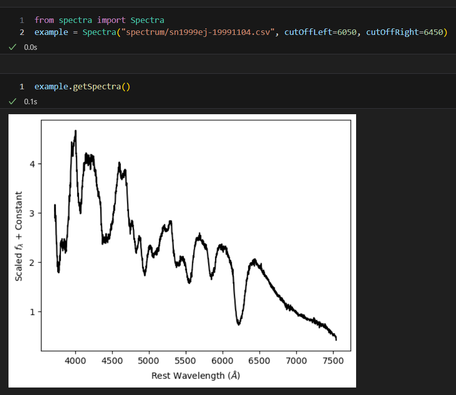

# How to use the function and class methods

<font size="6">```changeFileExtensions```</font>
::: extension.changeFileExtensions
<br>
<figure markdown style="text-align:center;">
  { width="500" }
  <figcaption style="width: 500px; margin: 0 auto; text-align: center;"> Example of how to use <code style="background-color: #f2f2f2; padding: 2px 4px; border-radius: 4px;">changeFileExtensions</code> function. "Spectrum" is a folder name in which there are spectra files.</figcaption>
</figure>
<br><br/>

<font size="6">```__init__```</font>
::: spectra.Spectra.__init__
<br>
<figure markdown style="text-align:center;">
  { width="500" }
  <figcaption style="width: 500px; margin: 0 auto; text-align: center;"> Example of how to initiate a Spectra class.    
    Define <code style="background-color: #f2f2f2; padding: 2px 4px; border-radius: 4px;">cutOffLeft</code> and <code style="background-color: #f2f2f2; padding: 2px 4px; border-radius: 4px;">cutOffRight</code> that are suitable for each spectrum. Spectrum can be obtained with <code style="background-color: #f2f2f2; padding: 2px 4px; border-radius: 4px;">getSpectra</code> attribute. The default values are 6020 and 6420.
  </figcaption>
</figure>


<font size="6">```fit```</font>
::: spectra.Spectra.fit
<br><br/>

<font size="6">```gauss```</font>
::: spectra.Spectra.gauss
<br><br/>

<font size="6">```readData```</font>
::: spectra.Spectra.readData
<br><br/>

<font size="6">```getSpectra```</font>
::: spectra.Spectra.getSpectra
<br><br/>

<font size="6">```getFit```</font>
::: spectra.Spectra.getFit
<br>
An example output is on [Tutorial](tutorials.md).
<br><br/>

<font size="6">```getAmplitude```</font>
::: spectra.Spectra.getAmplitude
<br>
<figure markdown style="text-align:center;">
  { width="500" }
  <figcaption>Example of how to use <code style="background-color: #f2f2f2; padding: 2px 4px; border-radius: 4px;">getAmplitude</code> attribute and the output.</figcaption>
</figure>
<br><br/>

<font size="6">```getMean```</font>
::: spectra.Spectra.getMean
<br><br/>

<font size="6">```getSigma```</font>
::: spectra.Spectra.getSigma
<br><br/>

<font size="6">```getOffset```</font>
::: spectra.Spectra.getOffset
<br><br/>

<font size="6">```getFWHM```</font>
::: spectra.Spectra.getFWHM
<br><br/>
