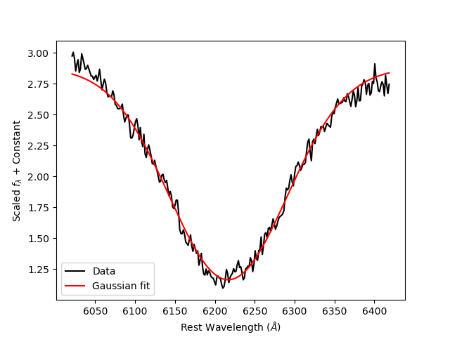

# What is this for?

This is for fitting Silicon absorption line on Type Ia supernova spectra. 
Spectra data for Type Ia supernova in .flm format (tab-separated) are available [here](https://lweb.cfa.harvard.edu/supernova/SNarchive.html).

<figure markdown style="text-align:center;">
  { width="500" }
  <figcaption>Example of Gaussian fit for Silicon absorption line.</figcaption>
</figure>

The flm files can be converted into csv files using 
[```changeFileExtensions```](functions/changeFileExtensions.md)
function inside extension.py file.
<br>

With the csv file, <code style="background-color: #f2f2f2; padding: 2px 4px; border-radius: 4px;">Spectra</code> class can be created and all attributes for the class can be used. 